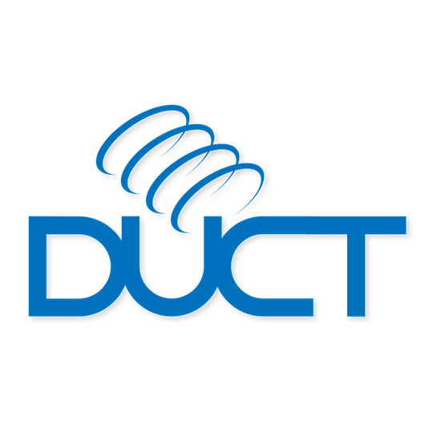

# Welcome to the DUCT library!

DUCT is the <b>D</b>otty <b>U</b>tilising <b>C</b>ategory <b>T</b>heory library.[^1]

Following in the footsteps of Scalaz and Cats, DUCT brings powerful and principled abstractions from Category Theory to Scala, but with some different design goals. DUCT is designed more for learning and experimentation than real world applications.

# Goals

* Simple (as possible) code.
* Code and tests written for humans, not compilers.
* Documented development on YouTube: [Functional Justin](https://www.youtube.com/c/FunctionalJustin) and my [blog](http://justinhj.github.io/).
* Scala 3 first; no backwards compatibility.

# Non-goals

* No IO type like Zio or Cats Effect. Although a future video and implementation is likely.
* Stack safety.
* Performance.
* Adoption.

# Documentation

At some point I may add proper code documentation but for now the code just links back to the video it was created in.

[^1]: Before Scala 3 was known as such it was known as [Dotty](https://dotty.epfl.ch/). 

&#169; 2021-2022 Justin Heyes-Jones and DUCT contributors. All Rights Reserved.